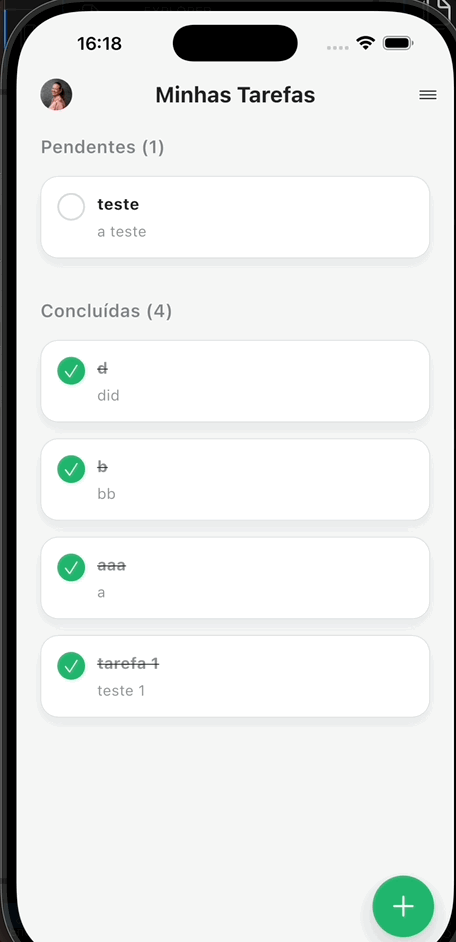

# app_todo

App de tarefas com autenticacao local e armazenamento offline.

## Funcionalidades
- Autenticacao local com cadastro, login/logout, sessao persistida e verificacao de email.
- Gestao de tarefas por usuario com armazenamento local (Hive): criacao, edicao e exclusao.
- Lista de tarefas separada por status (pendentes/concluidas) com alternancia de conclusao.
- Detalhes da tarefa com edicao de titulo/descricao e data de criacao.
- Perfil do usuario com edicao de nome/email e foto (selecionada no dispositivo).
- Preferencias basicas (notificacoes e idioma) e interface adaptada para iOS/Android.
